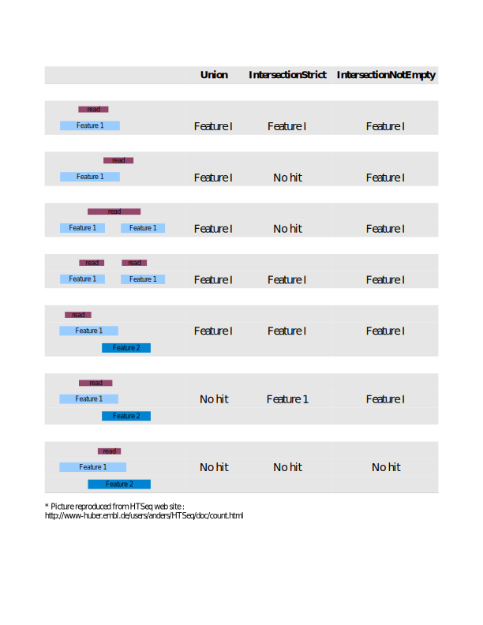

```{r options, echo=FALSE, include=FALSE}
knitr::opts_chunk$set(collapse = TRUE,eval = T)
options(width=72)
options("showHeadLines" = 3)
options("showTailLines" = 3)
```

# Introduction

This vignette illustrates how reads mapped to a genome can be counted
with `summarizeOverlaps`. Different "modes" of counting are provided to
resolve reads that overlap multiple features. The built-in count modes
are fashioned after the "Union", "IntersectionStrict", and
"IntersectionNotEmpty" methods found in the HTSeq package by Simon
Anders [@Anders2019][@Putri2022].

# A First Example

In this example reads are counted from a list of BAM files and returned
in a `matrix` for use in further analysis such as those offered in
`r Biocpkg("DESeq2")` and `r Biocpkg("edgeR")`.

```{r firstExample, eval=TRUE, keep.source=TRUE, message=FALSE, warning=FALSE}
library(GenomicAlignments)
library(DESeq2)
library(edgeR)
fls <- list.files(system.file("extdata", package="GenomicAlignments"),
    recursive=TRUE, pattern="*bam$", full=TRUE)
features <- GRanges(
    seqnames = c(rep("chr2L", 4), rep("chr2R", 5), rep("chr3L", 2)),
    ranges = IRanges(c(1000, 3000, 4000, 7000, 2000, 3000, 3600, 4000, 
        7500, 5000, 5400), width=c(rep(500, 3), 600, 900, 500, 300, 900, 
        300, 500, 500)), "-",
    group_id=c(rep("A", 4), rep("B", 5), rep("C", 2)))
olap <- summarizeOverlaps(features, fls)
deseq <- DESeqDataSet(olap, design= ~ 1)
edger <- DGEList(assay(olap), group=rownames(colData(olap)))
```

By default, the `summarizeOverlaps` function iterates through files
in
'chunks' and with files processed in parallel. For finer-grain control over memory consumption, use the`BamFileList` function and specify the`yieldSize` argument (e.g., `yieldSize=1000000` to determine the size of each 'chunk'
(smaller chunks consume less memory, but are a little less efficient to
process). For controlling the number of processors in use, use
`BiocParallel::register` to use an appropriate back-end, e.g.,
in linux or Mac to process on 6 cores of a single machine use
`register(MulticoreParam(workers=6))`; see the
`r Biocpkg("BiocParallel")` vignette for further details.

# Counting Modes

The modes of "Union", "IntersectionStrict" and "IntersectionNotEmpty"
provide different approaches to resolving reads that overlap multiple
features. Figure \@ref(fig:summarizeOverlaps-mode) illustrates how both
simple and gapped reads are handled by the modes. Note that a read is
counted a maximum of once; there is no double counting. For additional
detail on the counting modes see the `summarizeOverlaps` man page.

```{r, fig.width=7,fig.height=6, fig.cap="\\label{fig:figs}Counting Modes", fig.show = "hold", echo=FALSE, summarizeOverlaps-mode}

```

# Counting Features

Features can be exons, transcripts, genes or any region of interest. The
number of ranges that define a single feature is specified in the
`features` argument. When annotation regions of interest are defined by
a single range a `GRanges` should be used as the `features` argument.
With a *GRanges* it is assumed that each row (i.e., each range)
represents a distinct feature. If `features` was a *GRanges* of exons,
the result would be counts per exon. When the region of interest is
defined by one or more ranges the `features` argument should be a
*GRangesList*. In practice this could be a list of exons by gene or
transcripts by gene or other similar relationships. The count result
will be the same length as the *GRangesList*. For a list of exons by
genes, the result would be counts per gene. The combination of defining
the features as either *GRanges* or *GRangesList* and choosing a counting
mode controls how `summarizeOverlaps` assigns hits. Regardless of the
mode chosen, each read is assigned to at most a single feature. These
options are intended to provide flexibility in defining different
biological problems. This next example demonstrates how the same read
can be counted differently depending on how the `features` argument is
specified. We use a single read that overlaps two ranges, gr1 and gr2.

```{r simple}
rd <- GAlignments("a", seqnames = Rle("chr1"), pos = as.integer(100),
    cigar = "300M", strand = strand("+"))
gr1 <- GRanges("chr1", IRanges(start=50, width=150), strand="+")
gr2 <- GRanges("chr1", IRanges(start=350, width=150), strand="+")
```

When provided as a *GRanges* both gr1 and gr2 are considered
distinct features. In this case none of the modes count the read as a
hit. Mode `Union` discards the read becasue more than 1 feature is
overlapped. `IntersectionStrict` requires the read to fall completely
within a feature which is not the case for either gr1 or gr2.
`IntersetctionNotEmpty` requires the read to overlap a single unique
disjoint region of the `features`. In this case gr1 and gr2 do not
overlap so each range is considered a unique disjoint region. However,
the read overlaps both gr1 and gr2 so a decision cannot be made and the
read is discarded.

```{r simpleGRanges}
gr <- c(gr1, gr2)
data.frame(union = assay(summarizeOverlaps(gr, rd)),
           intStrict = assay(summarizeOverlaps(gr, rd,
               mode="IntersectionStrict")),
           intNotEmpty = assay(summarizeOverlaps(gr, rd,
               mode="IntersectionNotEmpty")))
```

Next we count with `features` as a *GRangesList*; this is list
of length 1 with 2 elements. Modes `Union` and `IntersectionNotEmpty`
both count the read for the single feature.

```{r simpleGRangesList}
grl <- GRangesList(c(gr1, gr2))
data.frame(union = assay(summarizeOverlaps(grl, rd)),
           intStrict = assay(summarizeOverlaps(grl, rd,
               mode="IntersectionStrict")),
           intNotEmpty = assay(summarizeOverlaps(grl, rd,
               mode="IntersectionNotEmpty")))
```

In this more complicated example we have 7 reads, 5 are simple and 2
have gaps in the CIGAR. There are 12 ranges that will serve as the
`features`.

```{r data}
group_id <- c("A", "B", "C", "C", "D", "D", "E", "F", "G", "G", "H", "H")
features <- GRanges(
    seqnames = Rle(c("chr1", "chr2", "chr1", "chr1", "chr2", "chr2",
        "chr1", "chr1", "chr2", "chr2", "chr1", "chr1")),
    strand = strand(rep("+", length(group_id))),
    ranges = IRanges(
        start=c(1000, 2000, 3000, 3600, 7000, 7500, 4000, 4000, 3000, 3350, 5000, 5400),
        width=c(500, 900, 500, 300, 600, 300, 500, 900, 150, 200, 500, 500)),
   DataFrame(group_id)
)
reads <- GAlignments(
    names = c("a","b","c","d","e","f","g"),
    seqnames = Rle(c(rep(c("chr1", "chr2"), 3), "chr1")),
    pos = as.integer(c(1400, 2700, 3400, 7100, 4000, 3100, 5200)),
    cigar = c("500M", "100M", "300M", "500M", "300M", "50M200N50M", "50M150N50M"),
    strand = strand(rep.int("+", 7L)))
```

Using a *GRanges* as the `features` all 12 ranges are
considered to be different features and counts are produced for each
row,

```{r GRanges}
data.frame(union = assay(summarizeOverlaps(features, reads)),
           intStrict = assay(summarizeOverlaps(features, reads,
               mode="IntersectionStrict")),
           intNotEmpty = assay(summarizeOverlaps(features, reads,
               mode="IntersectionNotEmpty")))
```

When the data are split by group to create a *GRangesList* the
highest list-levels are treated as different features and the multiple
list elements are considered part of the same features. Counts are
returned for each group.

```{r lst}
lst <- split(features, mcols(features)[["group_id"]])
length(lst)
```

```{r GRangesList}
data.frame(union = assay(summarizeOverlaps(lst, reads)),
           intStrict = assay(summarizeOverlaps(lst, reads,
               mode="IntersectionStrict")),
           intNotEmpty = assay(summarizeOverlaps(lst, reads,
               mode="IntersectionNotEmpty")))
```

If desired, users can supply their own counting function as the `mode`
argument and take advantage of the infrastructure for counting over
multiple BAM files and parsing the results into a
*RangedSummarizedExperiment* object. See `?'BamViews-class'` or
`?'BamFile-class'` in the `r Biocpkg("Rsamtools")` package.

# `pasilla` Data

In this excercise we count the `r Biocpkg("pasilla")` data by gene and by
transcript then create a *DESeqDataSet*. This object can be used in
differential expression methods offered in the `r Biocpkg("DESeq2")` package.

## Source files

Files are available through NCBI Gene Expression Omnibus (GEO),
accession number [GSE18508](http://www.ncbi.nlm.nih.gov/projects/geo/query/acc.cgi?acc=GSE18508).
SAM files can be converted to BAM with the `asBam` function in the
`r Biocpkg("Rsamtools")` package. Of the seven files available, 3 are
single-reads and 4 are paired-end. Smaller versions of untreated1
(single-end) and untreated2 (paired-end) have been made available in the
`r Biocpkg("pasillaBamSubset")` package. This subset includes chromosome 4
only. 
`summarizeOverlaps` is capable of counting paired-end reads in
both a `BamFile`-method (set argument `singleEnd=TRUE`) or a
`GAlignmentPairs`-method. For this example, we use the 3 single-end read
files,

- treated1.bam
- untreated1.bam
- untreated2.bam 

Annotations are retrieved as a GTF file
from the ENSEMBL web site. We download the file our local disk, then use
`r Biocpkg("Rtracklayer")`'s `import` function to parse the file to a
*GRanges* instance.

```{r gff, eval=FALSE}
library(rtracklayer)
fl <- paste0("ftp://ftp.ensembl.org/pub/release-62/",
             "gtf/drosophila_melanogaster/",
             "Drosophila_melanogaster.BDGP5.25.62.gtf.gz")
gffFile <- file.path(tempdir(), basename(fl))
download.file(fl, gffFile)
gff0 <- import(gffFile)
```

Subset on the protein-coding, exon regions of chromosome 4 and split by
gene id.

```{r gff_parse, eval=FALSE}
idx <- mcols(gff0)$source == "protein_coding" & 
           mcols(gff0)$type == "exon" & 
           seqnames(gff0) == "4"
gff <- gff0[idx]
## adjust seqnames to match Bam files
seqlevels(gff) <- paste("chr", seqlevels(gff), sep="")
chr4genes <- split(gff, mcols(gff)$gene_id)
```

## Counting

The `param` argument can be used to subset the reads in the bam file on
characteristics such as position, unmapped or paired-end reads. Quality
scores or the "NH" tag, which identifies reads with multiple mappings,
can be included as metadata columns for further subsetting. See
`?ScanBamParam` for details about specifying the `param` argument.

```{r pasilla_param}
param <- ScanBamParam(
 what='qual',
 which=GRanges("chr4", IRanges(1, 1e6)),
 flag=scanBamFlag(isUnmappedQuery=FALSE, isPaired=NA),
 tag="NH")
```

We use `summarizeOverlaps` to count with the default mode of "Union". If
a `param` argument is not included all reads from the BAM file are
counted.

```{r pasilla_count, eval=FALSE}
fls <- c("treated1.bam", "untreated1.bam", "untreated2.bam")
path <- "pathToBAMFiles"
bamlst <- BamFileList(fls)
genehits <- summarizeOverlaps(chr4genes, bamlst, mode="Union")
```

A `CountDataSet` is constructed from the counts and experiment
data in *pasilla*.

```{r pasilla_exoncountset, eval=FALSE}
expdata <- MIAME(
  name="pasilla knockdown",
  lab="Genetics and Developmental Biology, University of Connecticut
  Health Center",
  contact="Dr. Brenton Graveley",
  title="modENCODE Drosophila pasilla RNA Binding Protein RNAi knockdown RNA-Seq Studies",
  pubMedIds="20921232",
  url="http://www.ncbi.nlm.nih.gov/projects/geo/query/acc.cgi?acc=GSE18508",
  abstract="RNA-seq of 3 biological replicates of from the Drosophila
  melanogaster S2-DRSC cells that have been RNAi depleted of mRNAs 
  encoding pasilla, a mRNA binding protein and 4 biological replicates 
  of the the untreated cell line.")

design <- data.frame(
 condition=c("treated", "untreated", "untreated"),
 replicate=c(1,1,2),
 type=rep("single-read", 3),
 countfiles=path(colData(genehits)[,1]), stringsAsFactors=TRUE)

geneCDS <- DESeqDataSet(genehits, design=design, metadata=list(expdata=expdata))
```

If the primary interest is to count by transcript instead of by gene,
the annotation file can be split on transcript id.

```{r pasilla_genes, eval=FALSE}
chr4tx <- split(gff, mcols(gff)$transcript_id)
txhits <- summarizeOverlaps(chr4tx, bamlst)
txCDS <- DESeqDataSet(txhits, design=design, metadata=list(expdata=expdata))
```
